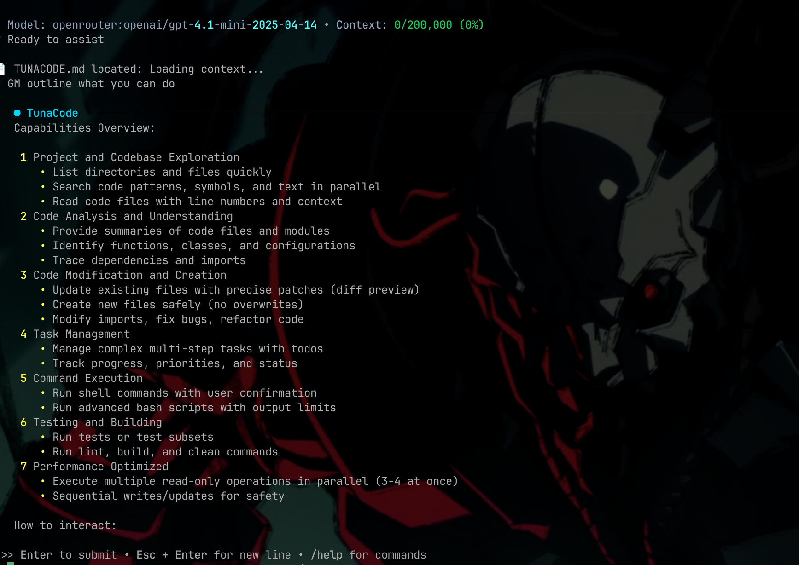

# TunaCode CLI

<div align="center">

[](https://badge.fury.io/py/tunacode-cli)
[](https://pepy.tech/project/tunacode-cli)
[](https://www.python.org/downloads/)
[](https://opensource.org/licenses/MIT)

**AI-powered CLI coding assistant**



</div>

---

## Quick Install

```bash
# Option 1: One-line install (Linux/macOS)
wget -qO- https://raw.githubusercontent.com/alchemiststudiosDOTai/tunacode/master/scripts/install_linux.sh | bash

# Option 2: pip install
pip install tunacode-cli
```

For detailed installation and configuration instructions, see the [**Getting Started Guide**](documentation/user/getting-started.md).

## Development Installation

For contributors and developers who want to work on TunaCode:

```bash
# Clone the repository
git clone https://github.com/alchemiststudiosDOTai/tunacode.git
cd tunacode

# Quick setup (recommended)
./scripts/setup_dev_env.sh

# Or manual setup
python3 -m venv venv
source venv/bin/activate  # On Windows: venv\Scripts\activate
pip install -e ".[dev]"

# Verify installation
python -m tunacode --version
```

See the [Hatch Build System Guide](documentation/development/hatch-build-system.md) for detailed instructions on the development environment.

## Configuration

Choose your AI provider and set your API key. For more details, see the [Configuration Section](documentation/user/getting-started.md#2-configuration) in the Getting Started Guide. For local models (LM Studio, Ollama, etc.), see the [Local Models Setup Guide](documentation/configuration/local-models.md).

### New: Enhanced Model Selection

TunaCode now automatically saves your model selection for future sessions. When you choose a model using `/model <provider:name>`, it will be remembered across restarts.

**If you encounter API key errors**, you can manually create a configuration file:

```bash
# Create the config directory and file
mkdir -p ~/.config/tunacode
cat > ~/.config/tunacode/tunacode.json << 'EOF'
{
  "default_model": "openai/gpt-4.1",
  "api_keys": {
    "openai": "your-openai-api-key-here"
  }
}
EOF
```

Replace the model name and API key with your preferred provider and credentials. Common providers:
- `openai/gpt-4.1` (requires OPENAI_API_KEY)
- `anthropic/claude-4-sonnet-20250522` (requires ANTHROPIC_API_KEY)
- `google/gemini-2.5-pro` (requires GOOGLE_API_KEY)

### ⚠️ Important Notice

I apologize for any recent issues with model selection and configuration. I'm actively working to fix these problems and improve the overall stability of TunaCode. Your patience and feedback are greatly appreciated as I work to make the tool more reliable.

### Recommended Models

Based on extensive testing, these models provide the best performance:

- `google/gemini-2.5-pro` - Excellent for complex reasoning
- `openai/gpt-4.1` - Strong general-purpose model
- `deepseek/deepseek-r1-0528` - Great for code generation
- `openai/gpt-4.1-mini` - Fast and cost-effective
- `anthropic/claude-4-sonnet-20250522` - Superior context handling

_Note: Formal evaluations coming soon. Any model can work, but these have shown the best results in practice._

## Start Coding

```bash
tunacode
```

## Basic Commands

| Command                  | Description            |
| ------------------------ | ---------------------- |
| `/help`                  | Show all commands      |
| `/model <provider:name>` | Switch model           |
| `/clear`                 | Clear message history  |
| `/compact`               | Summarize conversation |
| `/branch <name>`         | Create Git branch      |
| `/yolo`                  | Skip confirmations     |
| `!<command>`             | Run shell command      |
| `exit`                   | Exit TunaCode          |

## Performance

TunaCode leverages parallel execution for read-only operations, achieving **3x faster** file operations:


Multiple file reads, directory listings, and searches execute concurrently using async I/O, making code exploration significantly faster.

## Features in Development

- **Bug Fixes**: Actively addressing issues - please report any bugs you encounter!

_Note: While the tool is fully functional, we're focusing on stability and core features before optimizing for speed._

## Safety First

⚠️ **Important**: TunaCode can modify your codebase. Always:

- Use Git branches before making changes
- Review file modifications before confirming
- Keep backups of important work

## Documentation

For a complete overview of the documentation, see the [**Documentation Hub**](documentation/README.md).

### User Documentation

- [**Getting Started**](documentation/user/getting-started.md) - How to install, configure, and use TunaCode.
- [**Commands**](documentation/user/commands.md) - A complete list of all available commands.

### Developer Documentation

- **Architecture** (planned) - The overall architecture of the TunaCode application.
- **Contributing** (planned) - Guidelines for contributing to the project.
- **Tools** (planned) - How to create and use custom tools.
- **Testing** (planned) - Information on the testing philosophy and how to run tests.

### Guides

- [**Advanced Configuration**](documentation/configuration/config-file-example.md) - An example of an advanced configuration file.

### Reference

- **Changelog** (planned) - A history of changes to the application.
- **Roadmap** (planned) - The future direction of the project.
- **Security** (planned) - Information about the security of the application.

## Links

- [PyPI Package](https://pypi.org/project/tunacode-cli/)
- [GitHub Repository](https://github.com/alchemiststudiosDOTai/tunacode)
- [Report Issues](https://github.com/alchemiststudiosDOTai/tunacode/issues)

---

MIT License - see [LICENSE](LICENSE) file
