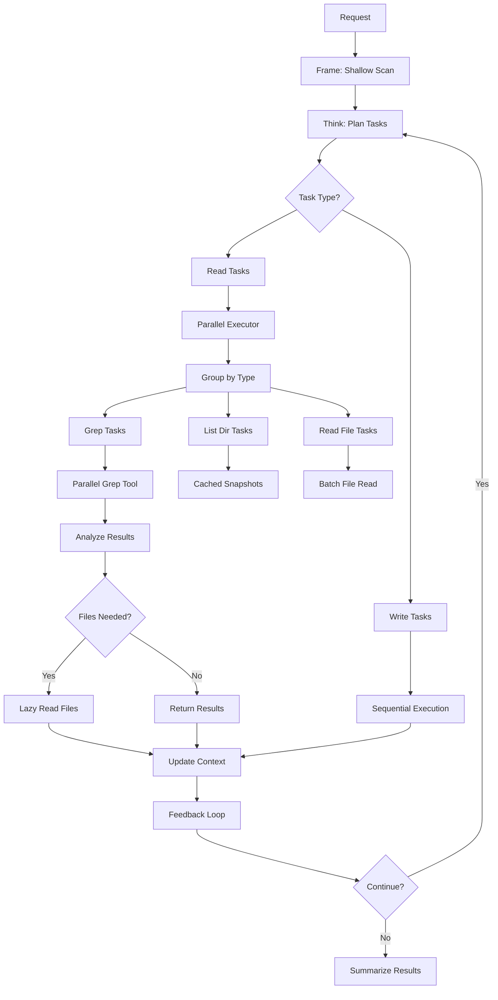

# Lazy File Reading Architecture

## Overview

The lazy file reading architecture implements the "read files as needed" pattern for the architect mode, significantly reducing unnecessary I/O operations and improving performance. This system integrates with the parallel grep tool and context provider to provide efficient file access.

## Key Components

### 1. Context Provider (`context_provider.py`)
Manages file content caching and lazy loading:
- **Shallow directory snapshots**: Non-recursive directory scans
- **File metadata caching**: Size, mtime, content hash
- **Lazy content loading**: Read files only when requested
- **Batch file reading**: Parallel file reads for efficiency
- **Git integration**: Track modified files for priority access

### 2. Parallel Executor (`parallel_executor.py`)
Executes read-only tasks in parallel:
- **Task batching**: Groups tasks by type for optimized execution
- **Specialized handlers**: Different strategies for read_file, list_dir, grep
- **Result aggregation**: Collects results from parallel operations
- **File analysis**: Determines which files need to be read based on grep results

### 3. Adaptive Orchestrator Integration
The orchestrator now uses the parallel executor for read tasks:
- **Task optimization**: Pre-filters tasks based on ignore patterns
- **Cached snapshots**: Reuses directory information
- **Search scope limiting**: Constrains grep to relevant files

## Architecture Flow



## Implementation Details

### Shallow Directory Scanning
```python
async def get_shallow_snapshot(self, directory: Path = None) -> DirectorySnapshot:
    """Get a shallow snapshot of a directory (non-recursive)."""
    # Check cache first
    if directory in self._dir_cache:
        snapshot = self._dir_cache[directory]
        if time.time() - snapshot.scan_time < self.cache_ttl:
            return snapshot
    
    # Perform shallow scan
    files = []
    subdirs = []
    for item in directory.iterdir():
        if not self.ignore_patterns.should_ignore(item):
            if item.is_file():
                files.append(item)
            elif item.is_dir():
                subdirs.append(item)
    
    return DirectorySnapshot(directory, files, subdirs)
```

### Batch File Reading
```python
async def batch_read_files(self, file_paths: List[Path]) -> Dict[Path, Optional[str]]:
    """Read multiple files in parallel for efficient batch operations."""
    valid_paths = [p for p in file_paths if not self.ignore_patterns.should_ignore(p)]
    
    tasks = [self.read_file_lazy(path) for path in valid_paths]
    results = await asyncio.gather(*tasks, return_exceptions=True)
    
    return {path: content for path, content in zip(valid_paths, results)}
```

### Task Optimization
```python
async def _optimize_task_for_context(self, task: Dict[str, Any]) -> Dict[str, Any]:
    """Optimize a task based on context and ignore patterns."""
    tool = task.get("tool")
    
    if tool == "list_dir":
        # Use cached snapshot
        snapshot = await self.context_provider.get_shallow_snapshot(dir_path)
        task["cached_snapshot"] = snapshot
    
    elif tool == "grep":
        # Limit search scope to relevant files
        relevant_files = await self.directory_indexer.get_relevant_files(query)
        task["search_scope"] = [str(f.path) for f in relevant_files[:20]]
    
    return task
```

## Performance Benefits

1. **Reduced I/O Operations**
   - Shallow scans instead of recursive walks
   - Cached directory snapshots
   - Lazy file content loading

2. **Parallel Execution**
   - Multiple files read concurrently
   - Batch operations for similar tasks
   - Non-blocking async operations

3. **Smart Caching**
   - File metadata cached with TTL
   - Content cached on first read
   - Git status cached for modified file detection

4. **Ignore Pattern Filtering**
   - Skip test directories by default
   - Respect .agentignore patterns
   - Filter at scan time, not read time

## Usage Example

```python
# Initialize components
context_provider = ContextProvider(project_root)
parallel_executor = ParallelExecutor(context_provider)

# Execute batch of read tasks
read_tasks = [
    {"tool": "grep", "args": {"pattern": "TODO", "directory": "."}},
    {"tool": "list_dir", "args": {"directory": "src"}},
    {"tool": "read_file", "args": {"file_path": "README.md"}}
]

results = await parallel_executor.execute_batch(read_tasks)

# Analyze grep results to find files needing read
files_to_read = await parallel_executor.find_files_needing_read(grep_results)

# Batch read the needed files
file_contents = await context_provider.batch_read_files(files_to_read)
```

## Integration with Architect Mode

The lazy file reading system is fully integrated with architect mode:

1. **Frame Phase**: Shallow scan builds initial directory index
2. **Think Phase**: Planner generates tasks without reading files
3. **Act Phase**: Parallel executor runs grep/list tasks first
4. **Analyze Phase**: Determine which files actually need reading
5. **Read Phase**: Batch read only necessary files
6. **Loop Phase**: Use findings to generate targeted follow-ups

This approach ensures that:
- Test directories are automatically skipped
- Only relevant files are read
- Multiple files are read in parallel
- Cache prevents redundant reads
- Git-modified files get priority

## Future Enhancements

1. **Incremental Indexing**: Update index based on file system events
2. **Content Hashing**: Skip reading unchanged files based on hash
3. **Streaming Reads**: Process large files in chunks
4. **Network Caching**: Share cache across sessions
5. **Predictive Prefetching**: Anticipate file needs based on patterns